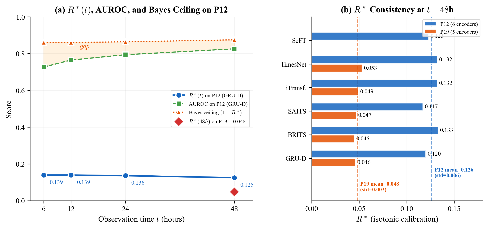

# Temporal Bayes Error R*(t) for Clinical Time Series

Preliminary experiments for estimating the Bayes-optimal error rate on irregularly sampled clinical time series (PhysioNet 2012 & 2019).

## R*(t) Curve (Real Data)



**(a)** R*(t) estimated at t = 6, 12, 24, 48h on PhysioNet 2012 using GRU-D with isotonic calibration. R* drops slowly from 0.139 to 0.125, but the gap between AUROC and the Bayes ceiling shrinks from 0.134 to 0.049. Early prediction (t=6h) has the most room for improvement.

**(b)** R* consistency across 6 encoders at t=48h. On P12: mean=0.126, std=0.006. On P19: mean=0.048, std=0.003. R* barely changes across architectures, confirming it is a data property.

## Results Summary

### R*(t) Truncation (P12, GRU-D)

| t (hours) | AUROC | Accuracy | R* | Ceiling | Gap |
|-----------|-------|----------|----|---------|-----|
| 6 | 0.727 | 0.849 | 0.139 | 0.861 | 0.134 |
| 12 | 0.765 | 0.850 | 0.139 | 0.861 | 0.097 |
| 24 | 0.794 | 0.859 | 0.136 | 0.864 | 0.070 |
| 48 | 0.826 | 0.871 | 0.125 | 0.875 | 0.049 |

### 6-Encoder Comparison at t=48h

**PhysioNet 2012:**

| Encoder | AUROC | R* (isotonic) | Ceiling |
|---------|-------|---------------|---------|
| GRU-D | 0.837 | 0.120 | 0.880 |
| BRITS | 0.796 | 0.133 | 0.867 |
| SAITS | 0.831 | 0.117 | 0.883 |
| iTransformer | 0.801 | 0.132 | 0.868 |
| TimesNet | 0.816 | 0.132 | 0.868 |
| SeFT | 0.834 | 0.123 | 0.877 |

**PhysioNet 2019:**

| Encoder | AUROC | R* (isotonic) | Ceiling |
|---------|-------|---------------|---------|
| GRU-D | 0.913 | 0.046 | 0.954 |
| BRITS | 0.886 | 0.045 | 0.955 |
| SAITS | 0.898 | 0.047 | 0.953 |
| iTransformer | 0.876 | 0.049 | 0.951 |
| TimesNet | 0.757 | 0.053 | 0.947 |

## Repository Structure

```
src/
  run_all_models_p12.py    # 6-encoder evaluation on P12 (t=48h)
  run_all_p19.py           # 6-encoder evaluation on P19 (t=48h)
  run_truncated_p12.py     # R*(t) truncation experiments (t=6,12,24,48h)
  preprocess_p19.py        # PhysioNet 2019 data preprocessing
  run_baseline.py          # Single-model baseline runner
experiments/
  p12/                     # Per-encoder metrics at t=48h
  p19/                     # Per-encoder metrics at t=48h
  truncated_p12_summary.json  # R*(t) truncation results
```

## Method

1. Train an encoder on patient records truncated at time t
2. Calibrate softmax outputs via 5-fold isotonic regression
3. Estimate R*(t) = 1/2 - 1/2 * mean(|2*eta_hat - 1|)
4. Repeat for t = 6, 12, 24, 48 hours

Based on [Ishida et al., ICLR 2023] and [Ushio et al., ICLR 2026].

## Setup

Requires [pypots](https://github.com/WenjieDu/PyPOTS) and PyTorch.

## Author

Chen Zhihao (czhbupt@gmail.com)
