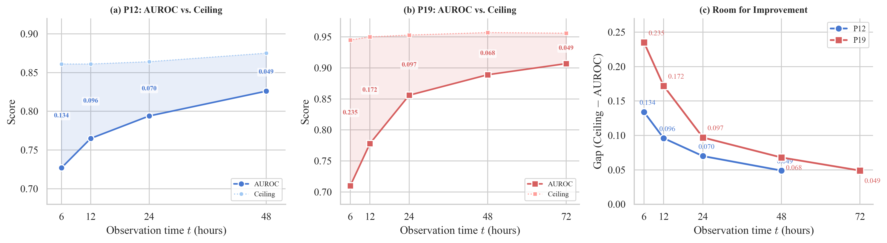

# Temporal Bayes Error R*(t) for Clinical Time Series

Preliminary experiments for the research proposal "Temporal Bayes Error R*(t) and Temporal Pconf URE for Irregular Clinical Time Series", submitted as part of the application to Prof. Takashi Ishida's laboratory at the University of Tokyo.

This repo contains all code and raw metrics used to generate the preliminary results in the proposal. The experiments estimate the Bayes-optimal error rate R*(t) at different observation horizons on PhysioNet 2012 and 2019, using six encoder architectures and isotonic calibration.

## Key Result



**(a) (b) AUROC vs. Bayes ceiling on P12 and P19.** Shaded region is the gap (ceiling − AUROC).

**(c) The gap shrinks with more observation time:**

| t (hours) | P12 gap | P19 gap |
|-----------|---------|---------|
| 6 | 0.134 | **0.236** |
| 12 | 0.096 | 0.172 |
| 24 | 0.070 | 0.097 |
| 48 | 0.049 | 0.068 |
| 72 | — | **0.049** |

On P19, the gap shrinks from **0.236 at t=6h to 0.049 at t=72h** (almost 5×). This quantifies where temporal Pconf can help: early horizons, where the model is still far from the theoretical ceiling.

## Pipeline Overview

```
Patient records (irregularly sampled)
            │
            ▼   truncate at t = {6, 12, 24, 48, 72}h
            ▼
Six encoders (GRU-D, BRITS, SAITS, iTransformer, TimesNet, SeFT)
            │
            ▼   5-fold CV
            ▼
Isotonic calibration → η̂(x)
            │
            ▼
R*(t) = ½ − ½·E[|2η̂(x) − 1|]
```

See [docs/METHOD.md](docs/METHOD.md) for more detail.

## Results

### R*(t) Truncation on PhysioNet 2019 (GRU-D)

| t (hours) | AUROC | Accuracy | R* | Ceiling | ECE |
|-----------|-------|----------|-----|---------|-----|
| 6 | 0.710 | 0.945 | 0.055 | 0.945 | 0.012 |
| 12 | 0.778 | 0.949 | 0.050 | 0.950 | 0.011 |
| 24 | 0.856 | 0.952 | 0.047 | 0.953 | 0.010 |
| 48 | 0.889 | 0.957 | 0.043 | 0.957 | 0.008 |
| 72 | 0.907 | 0.953 | 0.044 | 0.956 | 0.009 |

### Six-Encoder Consistency at t=48h

R* barely changes across encoder architectures, supporting the interpretation that it is a property of the dataset rather than the model:

| Encoder | P12 R* | P19 R* |
|---------|--------|--------|
| GRU-D [Che+ 2018] | 0.120 | 0.046 |
| BRITS [Cao+ 2018] | 0.133 | 0.045 |
| SAITS [Du+ 2023] | 0.117 | 0.047 |
| iTransformer [Liu+ 2024] | 0.132 | 0.049 |
| TimesNet [Wu+ 2023] | 0.132 | 0.053 |
| SeFT [Horn+ 2020] | 0.123 | N/A |
| **mean ± std** | **0.126 ± 0.006** | **0.048 ± 0.003** |

## Repository Structure

```
bayes-pconf-research/
├── src/
│   ├── calibration/
│   │   └── calibrators.py          # Isotonic regression, temperature scaling, ECE
│   ├── evaluation/
│   │   ├── bayes_error.py          # R* estimators (instance-free, Pconf)
│   │   └── metrics.py              # AUROC, Macro-F1, Accuracy
│   ├── experiments/
│   │   ├── run_p12_full.py         # 6 encoders × P12 at t=48h
│   │   ├── run_p19_full.py         # 6 encoders × P19 at t=48h
│   │   ├── run_p12_truncated.py    # R*(t) on P12, t ∈ {6,12,24,48}h
│   │   ├── run_p19_truncated.py    # R*(t) on P19, t ∈ {6,12,24,48,72}h
│   │   └── run_single_model.py     # Single-encoder runner for debugging
│   └── data_preprocess_p19.py      # PhysioNet 2019 .psv → numpy arrays
├── experiments/
│   ├── p12/                        # Metrics for 6 encoders on P12
│   ├── p19/                        # Metrics for 5 encoders on P19
│   ├── truncated_p12_summary.json  # R*(t) on P12
│   └── truncated_p19_summary.json  # R*(t) on P19
├── figures/
│   └── fig_rstar_curve.png
├── docs/
│   └── METHOD.md                   # Methodology details
├── requirements.txt
├── CITATION.cff
├── LICENSE
└── README.md
```

## Installation

```bash
git clone https://github.com/cher112/bayes-pconf-research.git
cd bayes-pconf-research
pip install -r requirements.txt
```

Requires Python ≥ 3.9 and a CUDA-capable GPU.

## Data

- **PhysioNet 2012** (11,988 ICU patients, 37 vars, 48h, 13.9% positive):
  loaded automatically via `benchpots.datasets.preprocess_physionet2012`.
- **PhysioNet 2019** (25,697 ICU patients, 34 vars, up to 72h, 5.5% positive):
  download .psv files from [physionet.org/content/challenge-2019/](https://physionet.org/content/challenge-2019/)
  and point `data_preprocess_p19.py` to the extracted directory.

PhysioNet datasets require credentialed access and are not redistributed here.

## Reproducing the Results

### Six-encoder comparison (t=48h)

```bash
python src/experiments/run_p12_full.py
python src/experiments/run_p19_full.py
```

Each script runs six encoders sequentially on a single GPU, saves softmax
probabilities, computes isotonic/temperature calibration, and writes
`experiments/{dataset}/{encoder}_metrics.json`. Expect ~60 minutes on a
single NVIDIA A100.

### R*(t) truncation curves

```bash
python src/experiments/run_p12_truncated.py
python src/experiments/run_p19_truncated.py
```

Each script trains GRU-D at four or five truncation horizons (6, 12, 24, 48, and
72h for P19). Expect ~10 minutes on P12, ~30 minutes on P19.

## Citation

This work builds on methods from Prof. Ishida's laboratory. If you use
these preliminary results, please cite the original papers:

### Pconf: Binary classification from positive-confidence data

```bibtex
@inproceedings{ishida2018pconf,
  title={Binary Classification from Positive-Confidence Data},
  author={Ishida, Takashi and Niu, Gang and Sugiyama, Masashi},
  booktitle={Advances in Neural Information Processing Systems (NeurIPS)},
  year={2018},
  url={https://proceedings.neurips.cc/paper/2018/hash/
       3cbaaa1c5b4e17c7a7ad81e1b81bbb20-Abstract.html}
}
```

### Instance-free Bayes error estimation

```bibtex
@inproceedings{ishida2023bayes,
  title={Is the Performance of My Deep Network Too Good to Be True?
         {A} Direct Approach to Estimating the {B}ayes Error in Binary
         Classification},
  author={Ishida, Takashi and Yamane, Ikko and Charoenphakdee, Nontawat
          and Niu, Gang and Sugiyama, Masashi},
  booktitle={International Conference on Learning Representations (ICLR, Oral)},
  year={2023},
  url={https://openreview.net/forum?id=FZdJQgy05rz}
}
```

### Isotonic calibration for corrupted soft labels

```bibtex
@inproceedings{ushio2026practical,
  title={Practical Estimation of the Optimal Classification Error with
         Soft Labels and Calibration},
  author={Ushio, Ryota and Ishida, Takashi and Sugiyama, Masashi},
  booktitle={International Conference on Learning Representations (ICLR)},
  year={2026}
}
```

### Encoder architectures

```bibtex
@article{che2018grud,
  title={Recurrent Neural Networks for Multivariate Time Series with
         Missing Values},
  author={Che, Zhengping and Purushotham, Sanjay and Cho, Kyunghyun
          and Sontag, David and Liu, Yan},
  journal={Scientific Reports},
  volume={8},
  year={2018}
}

@inproceedings{cao2018brits,
  title={{BRITS}: Bidirectional Recurrent Imputation for Time Series},
  author={Cao, Wei and Wang, Dong and Li, Jian and Zhou, Hao
          and Li, Lei and Li, Yitan},
  booktitle={NeurIPS},
  year={2018}
}

@article{du2023saits,
  title={{SAITS}: Self-Attention-based Imputation for Time Series},
  author={Du, Wenjie and Cote, David and Liu, Yan},
  journal={Expert Systems with Applications},
  year={2023}
}

@inproceedings{liu2024itransformer,
  title={i{T}ransformer: Inverted Transformers Are Effective for Time
         Series Forecasting},
  author={Liu, Yong and Hu, Tengge and Zhang, Haoran and Wu, Haixu
          and Wang, Shiyu and Ma, Lintao and Long, Mingsheng},
  booktitle={ICLR},
  year={2024}
}

@inproceedings{wu2023timesnet,
  title={{TimesNet}: Temporal 2{D}-Variation Modeling for General Time
         Series Analysis},
  author={Wu, Haixu and Hu, Tengge and Liu, Yong and Zhou, Hang
          and Wang, Jianmin and Long, Mingsheng},
  booktitle={ICLR},
  year={2023}
}

@inproceedings{horn2020seft,
  title={Set Functions for Time Series},
  author={Horn, Max and Moor, Michael and Bock, Christian and Rieck, Bastian
          and Borgwardt, Karsten},
  booktitle={ICML},
  year={2020}
}
```

### PhysioNet challenges

```bibtex
@article{reyna2020physionet2019,
  title={Early Prediction of Sepsis from Clinical Data: The
         {PhysioNet}/Computing in Cardiology Challenge 2019},
  author={Reyna, Matthew A. and Josef, Chris and Jeter, Russell and
          Shashikumar, Supreeth P. and Westover, M. Brandon and
          Nemati, Shamim and Clifford, Gari D. and Sharma, Ashish},
  journal={Critical Care Medicine},
  volume={48},
  number={2},
  pages={210--217},
  year={2020}
}

@inproceedings{silva2012physionet,
  title={Predicting in-hospital mortality of {ICU} patients:
         The {PhysioNet}/Computing in Cardiology Challenge 2012},
  author={Silva, Ikaro and Moody, George and Scott, Daniel J. and
          Celi, Leo A. and Mark, Roger G.},
  booktitle={Computing in Cardiology},
  year={2012}
}
```

## Author

Chen Zhihao (czhbupt@gmail.com)
M.Sc. Computer Science, Beijing Normal University (2023–2026)
Applying to the Graduate School of Frontier Sciences, University of Tokyo

## License

MIT — see [LICENSE](LICENSE).
